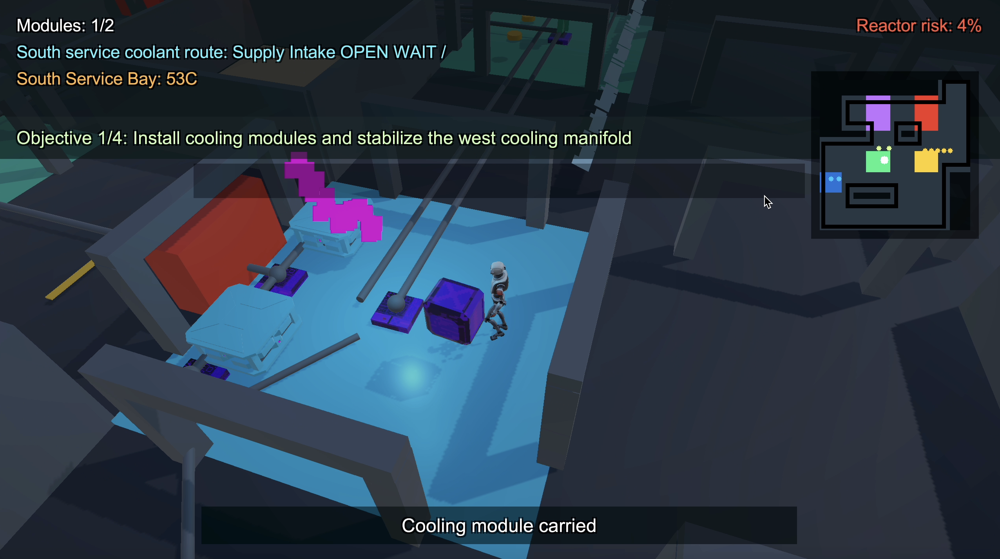
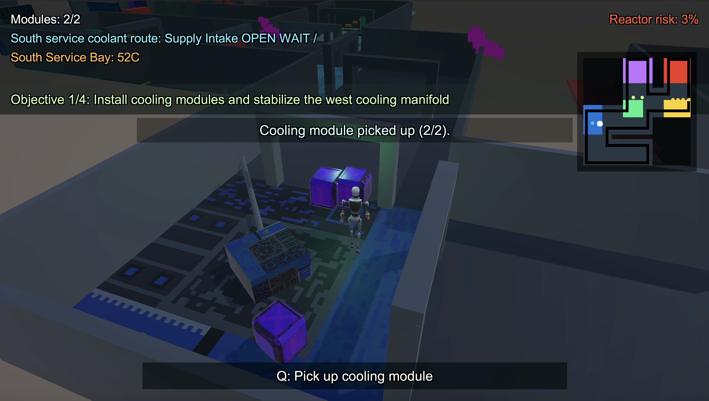

# Программирование игр
# Тема проекта: Реакторный техника

ФИО: _Федоров Алексей Алексеевич_\
Группа: _М8О-409Б-22_

## Видео
[Видео-демонстрация в файле demo.mov](demo.mov)
<video src="demo.mov" width="100%" controls></video>

## Что сделано:
3D-экшн на аварийной энергетической станции. Игрок в роли техника должен стабилизировать реактор, вручную восстанавливая систему охлаждения и открывая доступ к следующим секциям.
1) Управление персонажем в 3D-пространстве (перемещение, взаимодействие с объектами).
2) Перенос охлаждающих модулей между отсеками реактора с ограничением на количество одновременно переносимых предметов.
3) Система трубопроводов: поворот клапанов и перенаправление потоков охлаждения для снижения температуры в критических зонах.
4) Перегрев отсеков: постепенное повышение температуры, ограничивающее время нахождения игрока и требующее быстрого выполнения задач.

## Скриншоты

